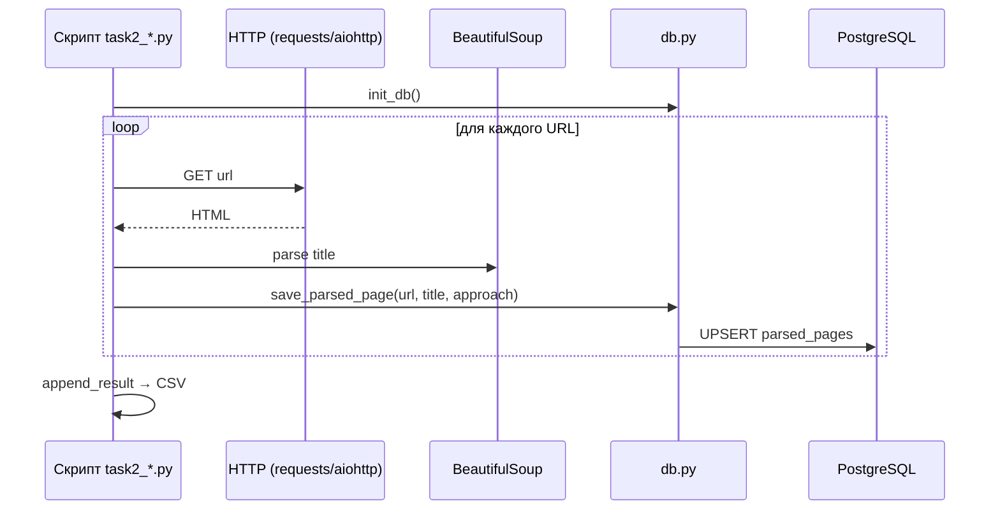

# Структура проекта

```text
ITMO_ICT_WebDevelopment_tools_2023-2024/   (ветка lab2)
├── task1_threading.py       # Задача 1: threading
├── task1_multiprocessing.py # Задача 1: multiprocessing
├── task1_async.py           # Задача 1: async
├── task2_threading.py       # Задача 2: threading
├── task2_multiprocessing.py # Задача 2: multiprocessing
├── task2_async.py           # Задача 2: async
├── common.py                # URL-списки и split-утилиты
├── benchmark.py             # Замер времени и запись CSV
├── db.py                    # Подключение к PostgreSQL
├── models.py                # SQLAlchemy-модель ParsedPage
├── results/                 # CSV с результатами бенчмарков
├── docs/                    # Исходники MkDocs
├── mkdocs.yml
├── requirements.txt
├── requirements-docs.txt
└── docker-compose.yml       # PostgreSQL для задачи 2
```

## Общие модули

### `common.py`

| Функция | Назначение |
|---------|------------|
| `URLS` | Список из 8 URL для задачи 2 |
| `split_into_ranges(start, end, parts)` | Делит числовой диапазон на части (задача 1) |
| `split_evenly(items, parts)` | Делит список URL на chunks (задача 2) |

### `benchmark.py`

| Функция | Назначение |
|---------|------------|
| `measure_seconds(func)` | Замеряет `perf_counter()`, возвращает `(result, elapsed)` |
| `append_result(csv, approach, elapsed, details)` | Дописывает строку в `results/*.csv` |

### `db.py`

- Sync и async движки SQLAlchemy
- `init_db_sync()` / `init_db_async()` — создание таблиц
- `save_parsed_page_sync()` / `save_parsed_page_async()` — upsert в `parsed_pages`
- Автоподмена `@db:5432` → `@localhost:5433` при запуске на хосте

### `models.py`

Модель `ParsedPage` — таблица `parsed_pages` с уникальным ключом `(url, approach)`.

## Зависимости

```
aiohttp          # async HTTP (задача 2)
beautifulsoup4   # парсинг HTML
requests         # sync HTTP (threading, multiprocessing)
sqlalchemy       # ORM
asyncpg          # async PostgreSQL
psycopg2-binary  # sync PostgreSQL
python-dotenv    # .env
```

## Поток данных (задача 2)


