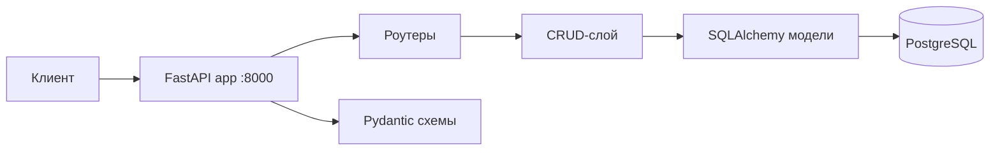
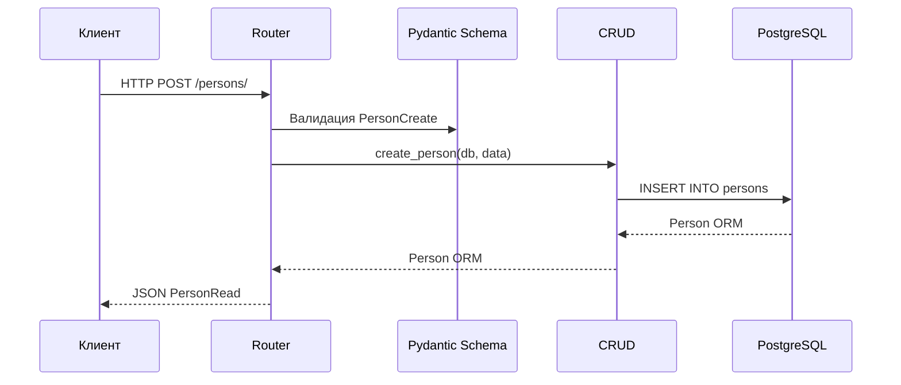

# Архитектура

## Общая схема



Приложение построено по классической трёхслойной схеме:

1. **Роутеры** (`app/routers/`) — HTTP-эндпоинты, валидация входных данных.
2. **CRUD** (`app/crud/`) — бизнес-логика и запросы к БД.
3. **Модели** (`app/models/`) — описание таблиц SQLAlchemy.

Pydantic-схемы (`app/schemas/`) отделяют формат API от внутренних моделей ORM.

## Структура проекта

```text
ITMO_ICT_WebDevelopment_tools_2023-2024/
├── app/
│   ├── main.py           # Точка входа FastAPI
│   ├── config.py         # Настройки из .env
│   ├── database.py       # Async engine и сессии
│   ├── models/           # SQLAlchemy-модели
│   ├── schemas/          # Pydantic-схемы
│   ├── crud/             # Операции с БД
│   └── routers/          # HTTP-маршруты
├── alembic/              # Миграции БД
├── script/migrations/    # SQL-скрипты (исходные)
├── docs/                 # Исходники MkDocs
├── parser/               # Отдельный HTTP-сервис парсера (lab3)
├── docker-compose.yml
├── Dockerfile
├── mkdocs.yml
└── requirements.txt
```

## Слои приложения

### `app/main.py`

Регистрирует роутеры и health-check:

```python
app = FastAPI(title="Finance API")
app.include_router(persons.router, prefix="/persons", tags=["persons"])
# ...
```

### `app/database.py`

- `create_async_engine` — подключение к PostgreSQL через `asyncpg`
- `AsyncSessionLocal` — фабрика сессий
- `get_db` — dependency для FastAPI

### `app/config.py`

Настройки загружаются из `.env` через `pydantic-settings`:

- `DATABASE_URL` — async-подключение
- `DATABASE_URL_SYNC` — sync-подключение (Alembic, Celery)

## Поток обработки запроса



## Принципы

- **Async-first** — все эндпоинты и CRUD-операции асинхронные.
- **Разделение ответственности** — роутер не содержит SQL-запросов.
- **Миграции** — изменения схемы только через Alembic.
- **Типизация** — аннотации типов и Pydantic-модели на границе API.
