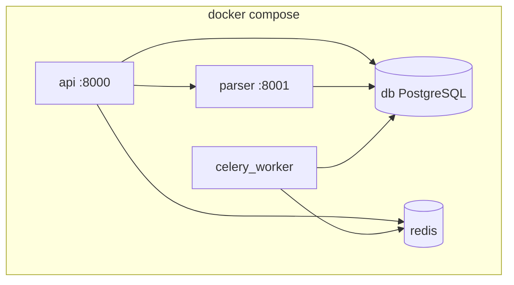
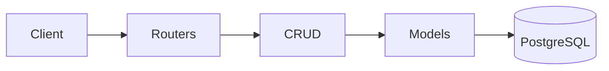

# Архитектура lab3

Проект объединяет **лабу 1** (Finance API), **лабу 2** (парсинг в `lab2/`) и новую инфраструктуру Docker + Celery.

## Структура репозитория

```text
├── app/                    # Finance API (lab1)
│   ├── main.py
│   ├── routers/parser.py   # прокси и async-парсинг
│   ├── celery_app.py
│   └── tasks/parser_tasks.py
├── parser_service/         # HTTP-микросервис парсера
│   ├── main.py
│   └── core.py
├── lab2/                   # скрипты lab2 (threading/mp/async)
├── docker/
│   ├── api.Dockerfile
│   └── parser.Dockerfile
├── runtime_env.py          # подмена db/parser/redis → localhost
├── docker-compose.yml
└── docs/
```

## Docker Compose



| Сервис | Образ | Назначение |
|--------|-------|------------|
| `api` | `docker/api.Dockerfile` | Finance API + Alembic migrate |
| `parser` | `docker/parser.Dockerfile` | HTTP-парсер |
| `celery_worker` | `docker/api.Dockerfile` | Celery worker |
| `db` | `postgres:16-alpine` | PostgreSQL |
| `redis` | `redis:7-alpine` | Брокер Celery |

## Слои Finance API



Парсер добавлен как отдельный роутер `app/routers/parser.py` — не затрагивает CRUD finance-сущностей.

## Два пути парсинга

Подробная схема — на странице [Парсинг](parser-architecture.md).

| Путь | Эндпоинт | Механизм |
|------|----------|----------|
| Синхронный | `POST /parser/parse` | API → httpx → parser_service → multiprocessing |
| Асинхронный | `POST /parser/parse-async` | API → Redis → Celery → sequential parse |

## Конфигурация (`runtime_env.py`)

При запуске **на хосте** (не в Docker) автоматически:

| В `.env` | Становится |
|----------|------------|
| `@db:5432` | `@localhost:5433` |
| `http://parser:8001` | `http://localhost:8001` |
| `redis://redis:6379` | `redis://localhost:6379` |

Один `.env` с Docker-именами работает и в compose, и локально.

## Ключевые файлы

| Файл | Роль |
|------|------|
| `app/routers/parser.py` | `/parser/parse`, `/parser/parse-async`, `/parser/tasks/{id}` |
| `parser_service/core.py` | `parse_urls_multiprocessing`, сохранение в БД |
| `app/tasks/parser_tasks.py` | Celery-задача `parse_urls_task` |
| `app/celery_app.py` | Конфигурация Celery + Redis |
| `lab2/db.py` | `save_parsed_page_sync()` → таблица `parsed_pages` |
| `app/config.py` | Settings из `.env` + `runtime_env` |
