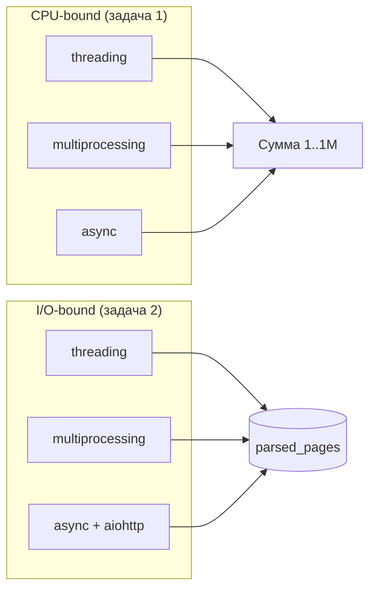

# Лабораторная работа 2

Сравнение трёх подходов к параллельности в Python:

- **threading** — потоки в одном процессе
- **multiprocessing** — отдельные процессы
- **async** — кооперативная многозадачность (`asyncio`)

## Задачи

| Задача | Описание | Файлы |
|--------|----------|-------|
| [Задача 1](task1.md) | Подсчёт суммы от 1 до 1 000 000 | `task1_*.py` |
| [Задача 2](task2.md) | Параллельный парсинг URL с сохранением в БД | `task2_*.py` |

## Цель работы

Понять отличия потоков, процессов и асинхронности на практических примерах и сравнить время выполнения.



## Быстрый запуск

```bash
git checkout lab2
python3 -m venv venv && source venv/bin/activate
pip install -r requirements.txt
cp .env.example .env

# Задача 1
python task1_threading.py
python task1_multiprocessing.py
python task1_async.py

# Задача 2 (нужна PostgreSQL)
python task2_threading.py
python task2_multiprocessing.py
python task2_async.py
```

Результаты сохраняются в `results/task1_times.csv` и `results/task2_times.csv`.

## Документация

| Раздел | Содержание |
|--------|------------|
| [Быстрый старт](getting-started.md) | Установка и настройка БД |
| [Задача 1](task1.md) | Подсчёт суммы тремя способами |
| [Задача 2](task2.md) | Парсинг веб-страниц |
| [Результаты](results.md) | Таблицы времени выполнения |
| [Архитектура](architecture.md) | Структура файлов проекта |

## MkDocs

```bash
pip install -r requirements-docs.txt
mkdocs serve -a 127.0.0.1:8002
```

### GitHub Pages

После push в `lab2` workflow публикует сайт автоматически:

[https://gsixo.github.io/ITMO_ICT_WebDevelopment_tools_2023-2024/](https://gsixo.github.io/ITMO_ICT_WebDevelopment_tools_2023-2024/)

Настройка: **Settings → Pages → Source: GitHub Actions**.
