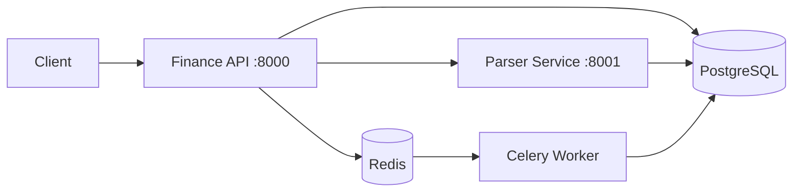

# Лабораторная работа 3

Упаковка FastAPI-приложения в **Docker**, интеграция **парсера** с базой данных и вызов парсера через **HTTP** и **очередь Celery**.

## Что реализовано

| Подзадача | Описание |
|-----------|----------|
| Docker | FastAPI, PostgreSQL, parser-сервис в контейнерах |
| HTTP-парсер | Отдельный микросервис `parser_service` на порту 8001 |
| Прокси в API | `POST /parser/parse` — синхронный вызов парсера |
| Очередь Celery | `POST /parser/parse-async` — фоновый парсинг через Redis |
| Lab 1 + Lab 2 | Finance API и код парсинга из предыдущих лаб |

## Стек



| Компонент | Технология |
|-----------|------------|
| API | FastAPI, SQLAlchemy async |
| Parser | FastAPI + requests + BeautifulSoup |
| Очередь | Celery + Redis |
| Контейнеры | Docker Compose |
| БД | PostgreSQL (`finance_db` + `parsed_pages`) |

## Быстрый запуск

```bash
git checkout lab3
docker compose up --build
```

- API: [http://localhost:8000/docs](http://localhost:8000/docs)
- Parser: [http://localhost:8001/docs](http://localhost:8001/docs)

## Разделы документации

| Страница | Содержание |
|----------|------------|
| [Быстрый старт](getting-started.md) | Локальный и Docker-запуск |
| [Архитектура](architecture.md) | Структура проекта lab3 |
| [Парсинг](parser-architecture.md) | Схема синхронного и async-парсинга |
| [API](api.md) | Finance API + parser endpoints |
| [Docker](docker.md) | Сервисы и переменные окружения |

## MkDocs

```bash
pip install -r requirements-docs.txt
mkdocs serve -a 127.0.0.1:8002
```

## GitHub Pages

Каждая лаба — отдельная версия (mike), документации не перезаписывают друг друга:

| Ветка | URL |
|-------|-----|
| lab1 | […/lab1/](https://gsixo.github.io/ITMO_ICT_WebDevelopment_tools_2023-2024/lab1/) |
| lab2 | […/lab2/](https://gsixo.github.io/ITMO_ICT_WebDevelopment_tools_2023-2024/lab2/) |
| lab3 | […/lab3/](https://gsixo.github.io/ITMO_ICT_WebDevelopment_tools_2023-2024/lab3/) |

**Settings → Pages → Deploy from branch → `gh-pages` → `/ (root)`**

После push в `lab3` дождитесь зелёного workflow **Deploy MkDocs to GitHub Pages**.
