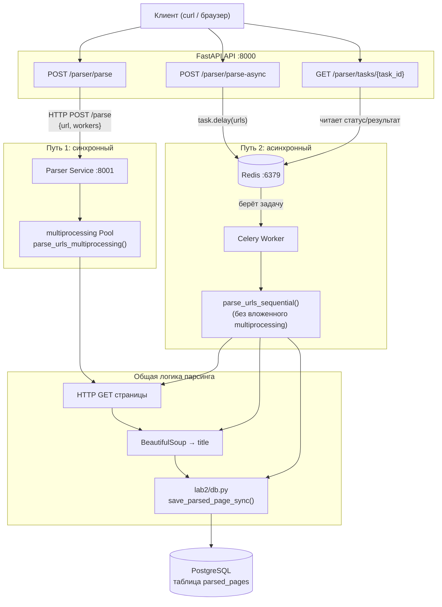

# Схема парсинга в приложении

В проекте реализованы **два способа** парсинга URL: синхронный (через отдельный parser-сервис) и асинхронный (через очередь Celery).

## Общая архитектура



## Путь 1: синхронный — `POST /parser/parse`

```
Клиент → API → Parser Service → сайты → БД → ответ клиенту
```

1. Клиент отправляет URL в API.
2. API **сразу** проксирует запрос в Parser Service (`httpx`).
3. Parser Service скачивает страницы **параллельно** (`multiprocessing`).
4. Заголовки сохраняются в PostgreSQL (`parsed_pages`).
5. API возвращает **готовый результат** — клиент ждёт до конца.

**Когда использовать:** нужен результат сразу, объём небольшой.

### Пример

```bash
curl -X POST "http://localhost:8000/parser/parse" \
  -H "Content-Type: application/json" \
  -d '{"url":"https://example.com","workers":4}'
```

## Путь 2: асинхронный — `POST /parser/parse-async`

```
Клиент → API → Redis → Celery Worker → сайты → БД
                ↑
         GET /parser/tasks/{id}
```

1. Клиент отправляет URL в API.
2. API кладёт задачу в **Redis** (`parse_urls_task.delay()`).
3. API сразу отвечает: `task_id`, `status: QUEUED`.
4. **Celery Worker** забирает задачу из очереди.
5. Парсит URL **последовательно** (в worker нельзя вложенный multiprocessing).
6. Сохраняет в таблицу `parsed_pages`.
7. Результат кладётся в Redis (result backend).
8. Клиент опрашивает `GET /parser/tasks/{task_id}`: `PENDING` → `STARTED` → `SUCCESS`.

**Когда использовать:** долгий парсинг, не нужно блокировать HTTP-ответ.

### Пример

```bash
# Поставить задачу в очередь
curl -X POST "http://localhost:8000/parser/parse-async" \
  -H "Content-Type: application/json" \
  -d '{"url":"https://example.com"}'

# Проверить статус (подставить task_id из ответа)
curl "http://localhost:8000/parser/tasks/<task_id>"
```

## Роли компонентов

| Компонент | Порт | Роль |
|-----------|------|------|
| **API** | 8000 | Точка входа, маршрутизация запросов |
| **Parser Service** | 8001 | Отдельный микросервис, параллельный парсинг |
| **Redis** | 6379 | Очередь задач и хранение статусов Celery |
| **Celery Worker** | — | Фоновое выполнение `parse_urls_task` |
| **PostgreSQL** | 5433 (host) | Таблица `parsed_pages`: `url`, `title`, `approach`, `fetched_at` |

## Docker Compose

```text
┌─────────┐     ┌─────────┐     ┌──────────────┐
│  api    │────▶│ parser  │     │ celery_worker│
│  :8000  │     │  :8001  │     │              │
└────┬────┘     └────┬────┘     └──────┬───────┘
     │               │                    │
     └───────────────┼────────────────────┘
                     ▼
              ┌─────────────┐      ┌───────┐
              │ PostgreSQL  │      │ Redis │
              │    (db)     │      │       │
              └─────────────┘      └───────┘
```

Внутри Docker сервисы общаются по именам `db`, `parser`, `redis`.
С хоста — через `localhost` и проброшенные порты.

## Ключевые файлы

| Файл | Назначение |
|------|------------|
| `app/routers/parser.py` | Эндпоинты `/parser/parse`, `/parser/parse-async`, `/parser/tasks/{id}` |
| `parser_service/main.py` | HTTP-сервис парсера |
| `parser_service/core.py` | Логика скачивания и сохранения страниц |
| `app/tasks/parser_tasks.py` | Celery-задача `parse_urls_task` |
| `app/celery_app.py` | Конфигурация Celery |
| `lab2/db.py` | Подключение к БД и `save_parsed_page_sync()` |

## Важные детали

- Оба пути пишут в одну таблицу `parsed_pages` через `lab2/db.py`.
- Синхронный путь использует `multiprocessing`; асинхронный — `sequential` внутри Celery worker.
- Без **Redis** и **Celery Worker** `/parse-async` не работает (задача останется в `PENDING`).
- Без **Parser Service** не работает `/parse`, но `/parse-async` может работать (worker парсит сам).

## Запуск для асинхронного парсинга

```bash
docker compose up -d db redis
celery -A app.celery_app:celery_app worker --loglevel=info   # отдельный терминал
uvicorn app:app --reload                                      # отдельный терминал
```
