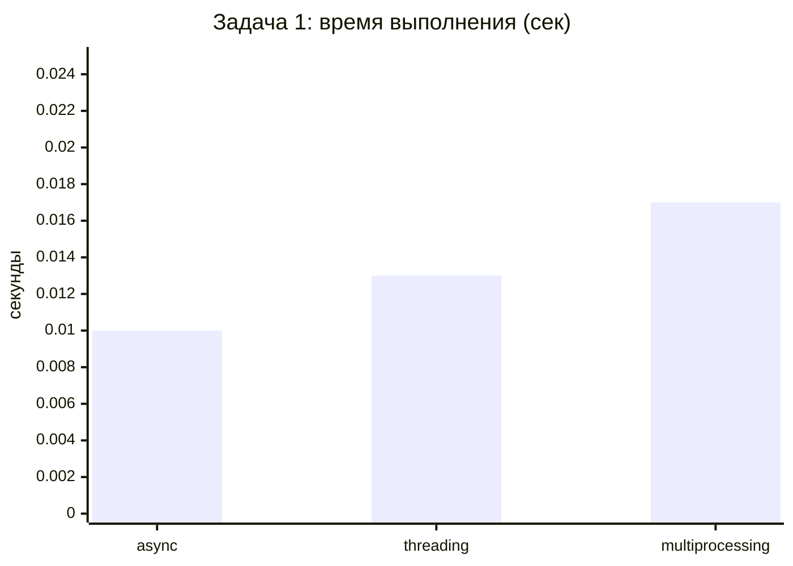
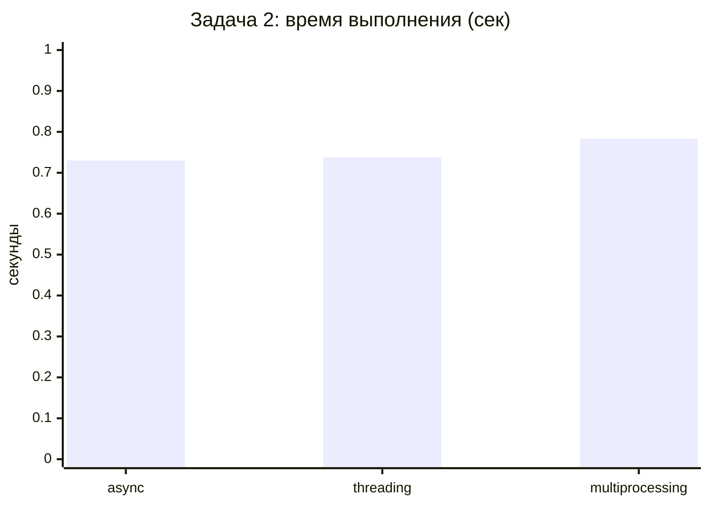

# Результаты бенчмарков

Время измеряется через `time.perf_counter()` в `benchmark.py` и дописывается в CSV.

## Задача 1 — сумма 1..1 000 000

Файл: `results/task1_times.csv`

| Подход | Лучшее время, с | Среднее, с* |
|--------|-----------------|-------------|
| **async** | 0.010 | ~0.011 |
| **threading** | 0.013 | ~0.014 |
| **multiprocessing** | 0.017 | ~0.020 |

\* по всем запускам в CSV



### Комментарий

Все три подхода дают правильную сумму `500000500000`. Разница во времени небольшая, потому что:

- задача **CPU-bound** — основное время уходит на `sum(range(...))`;
- **GIL** не даёт потокам реального параллелизма на CPU;
- **async** с `sleep(0)` не ускоряет вычисления, только демонстрирует кооперативность;
- **multiprocessing** имеет накладные расходы на создание процессов, которые на короткой задаче могут перевесить выигрыш.

На больших CPU-нагрузках multiprocessing обычно вырывается вперёд.

## Задача 2 — парсинг 8 URL

Файл: `results/task2_times.csv`

| Подход | Лучшее время, с | Примечание |
|--------|-----------------|------------|
| **async** | 0.730 | aiohttp, параллельные запросы |
| **threading** | 0.738 | requests в потоках |
| **multiprocessing** | 0.783 | отдельные процессы |



### Комментарий

Задача **I/O-bound** — большую часть времени программа ждёт ответа сервера.

- **async** чуть быстрее: один event loop, много одновременных HTTP-запросов без блокировки.
- **threading** близок по времени: GIL отпускается при сетевых операциях.
- **multiprocessing** медленнее из-за fork/spawn и отдельных подключений к БД.

!!! note "Зависимость от сети"
    Время сильно зависит от доступности сайтов, таймаутов и скорости интернета. Отдельные URL (Wikipedia, FastAPI docs) могут вернуть ошибку 403 или timeout.

## Как перезапустить бенчмарки

```bash
# очистить старые результаты (опционально)
rm results/task1_times.csv results/task2_times.csv

# задача 1
python task1_threading.py && python task1_multiprocessing.py && python task1_async.py

# задача 2
python task2_threading.py && python task2_multiprocessing.py && python task2_async.py
```

## Сводная таблица

| Тип задачи | Лучший подход | Худший подход |
|------------|---------------|---------------|
| CPU-bound (сумма) | multiprocessing* | async |
| I/O-bound (HTTP) | async | multiprocessing |

\* при достаточно большой нагрузке; на малых данных накладные расходы multiprocessing заметны.
