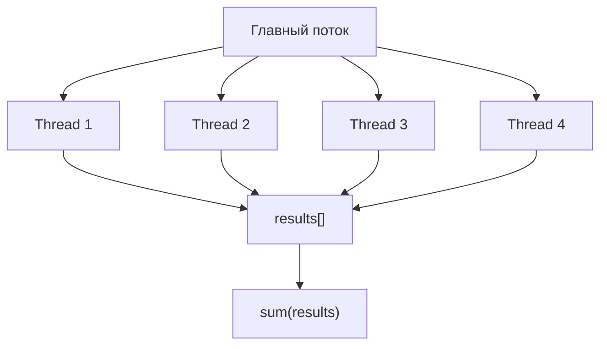
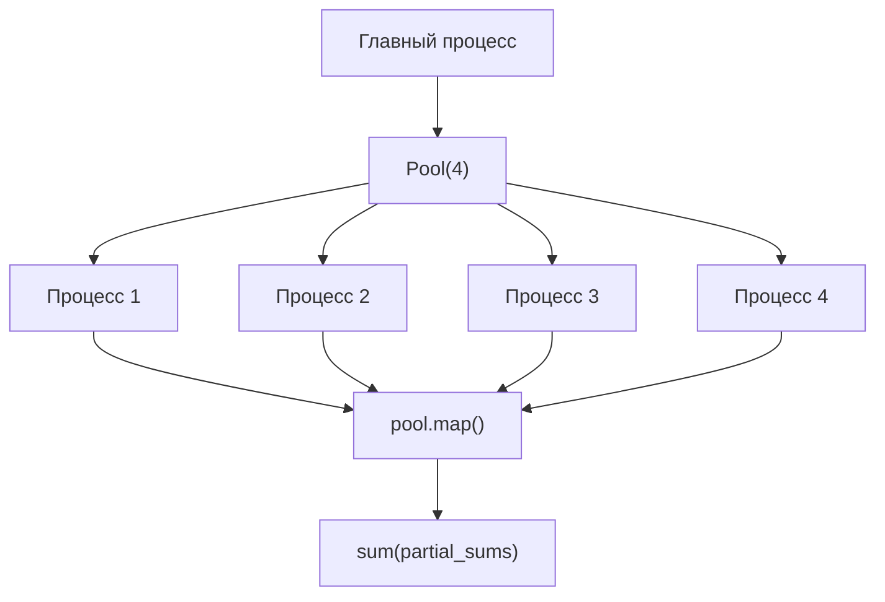
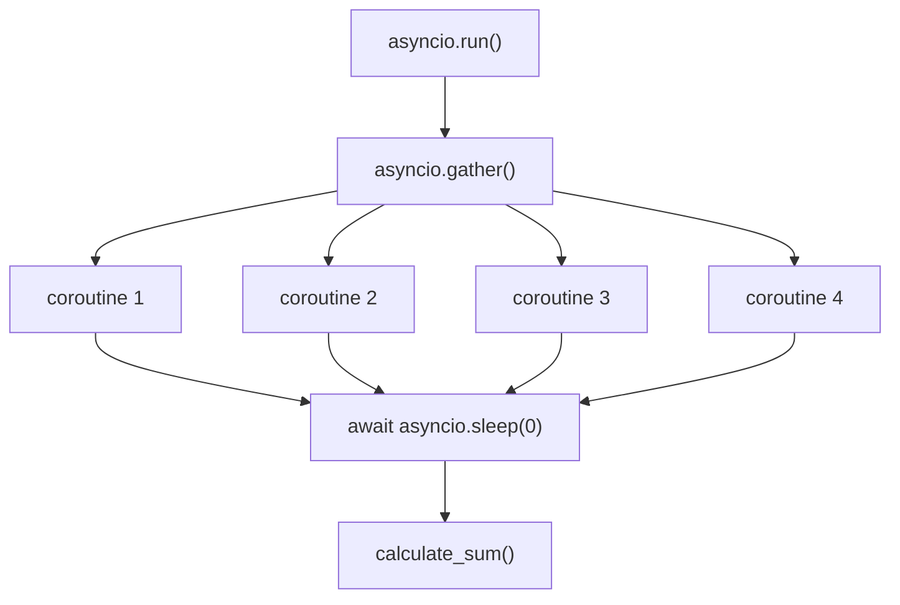

# Задача 1 — подсчёт суммы

Подсчитать сумму чисел от **1** до **1 000 000**, разбив диапазон на **4** части и выполнив их параллельно.

## Постановка

| Параметр | Значение |
|----------|----------|
| Диапазон | 1 … 1 000 000 |
| Workers | 4 |
| Ожидаемый результат | 500 000 500 000 |

Функция `calculate_sum(start, end)` считает `sum(range(start, end + 1))`.

## Реализации

### Threading — `task1_threading.py`



- Модуль `threading`, по одному потоку на диапазон
- Общий список `results` в памяти процесса
- `thread.join()` — ожидание завершения

### Multiprocessing — `task1_multiprocessing.py`



- `multiprocessing.Pool` с `pool.map`
- Каждый процесс — отдельная память, обход GIL для CPU-задач

### Async — `task1_async.py`



- `async def` + `asyncio.gather`
- `await asyncio.sleep(0)` — точка уступки event loop
- **Не ускоряет CPU-bound**: `calculate_sum` блокирует event loop

## Запуск

```bash
python task1_threading.py
python task1_multiprocessing.py
python task1_async.py
```

Время записывается в `results/task1_times.csv`.

## Выводы

| Подход | CPU-bound задача | Почему |
|--------|------------------|--------|
| **threading** | Слабое ускорение | GIL — только один поток выполняет Python-байткод |
| **multiprocessing** | Лучшее ускорение | Отдельные процессы, каждый со своим GIL |
| **async** | Почти без ускорения | Кооперативность не помогает при чистых вычислениях |

Для **I/O-bound** задач (задача 2) картина меняется — см. [Задача 2](task2.md).
