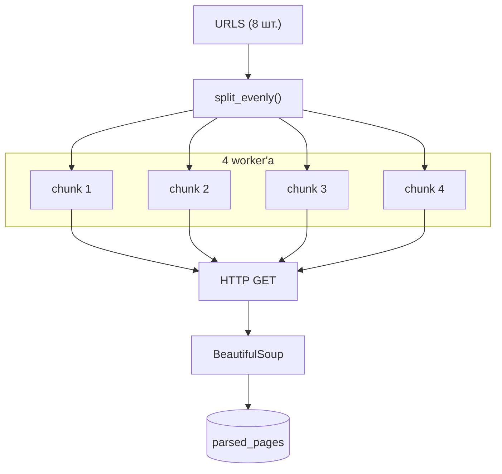

# Задача 2 — параллельный парсинг

Параллельно загрузить несколько веб-страниц, извлечь `<title>` и сохранить в PostgreSQL.

## Постановка

- 8 URL из `common.py`
- 4 worker'а — URL делятся через `split_evenly()`
- Функция `parse_and_save(url)` — GET → BeautifulSoup → INSERT в `parsed_pages`
- Поле `approach` — `threading`, `multiprocessing` или `async`

## URL для парсинга

| # | URL |
|---|-----|
| 1 | https://example.com |
| 2 | https://www.python.org |
| 3 | https://docs.python.org/3/ |
| 4 | https://httpbin.org/html |
| 5 | https://www.wikipedia.org |
| 6 | https://pypi.org |
| 7 | https://github.com |
| 8 | https://fastapi.tiangolo.com |

## Архитектура



## Реализации

### Threading — `task2_threading.py`

- `requests.get()` — синхронный HTTP
- 4 потока, каждый обрабатывает свой chunk URL
- `save_parsed_page_sync()` — sync SQLAlchemy

**Плюс для I/O:** пока один поток ждёт сеть, другие работают (GIL отпускается на I/O).

### Multiprocessing — `task2_multiprocessing.py`

- `multiprocessing.Process` — отдельный процесс на chunk
- Каждый процесс делает свои HTTP-запросы и пишет в БД
- Больше накладных расходов на создание процессов

### Async — `task2_async.py`

- `aiohttp.ClientSession` — неблокирующий HTTP
- `asyncio.gather()` — параллельные корутины
- `save_parsed_page_async()` — async SQLAlchemy

**Плюс для I/O:** один поток, много одновременных сетевых запросов без блокировки.

## Схема БД

Таблица `parsed_pages` (`models.py`):

| Поле | Тип | Описание |
|------|-----|----------|
| `id` | INTEGER | PK |
| `url` | VARCHAR(2048) | Адрес страницы |
| `title` | VARCHAR(1024) | Заголовок |
| `approach` | VARCHAR(32) | threading / multiprocessing / async |
| `fetched_at` | TIMESTAMP | Время парсинга |

Уникальный ключ: `(url, approach)`.

## Запуск

```bash
python task2_threading.py
python task2_multiprocessing.py
python task2_async.py
```

Результаты → `results/task2_times.csv`.

## Выводы

| Подход | I/O-bound задача | Почему |
|--------|------------------|--------|
| **threading** | Хорошо | Потоки ждут сеть параллельно |
| **multiprocessing** | Хорошо, но тяжелее | Процессы + накладные расходы |
| **async** | Лучший для сети | Много соединений в одном потоке |

Для CPU-bound (задача 1) multiprocessing выигрывает; для сетевого I/O — async и threading.
